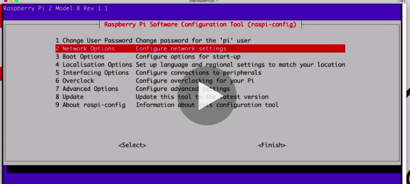
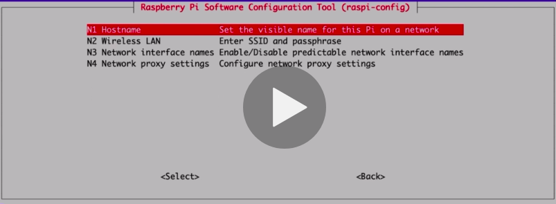

# Node-RED ESP32 Project

### Setting hostname on Raspberry Pi

* Open raspi-config utility
```
sudo raspi-config
```

* Go to network options


* Change hostname


* Change it to a reasonable name. For eg:

```
nodered.local
```


sudo npm install -g --unsafe-perm node-red
sudo apt install mosquitto mosquitto-clients
